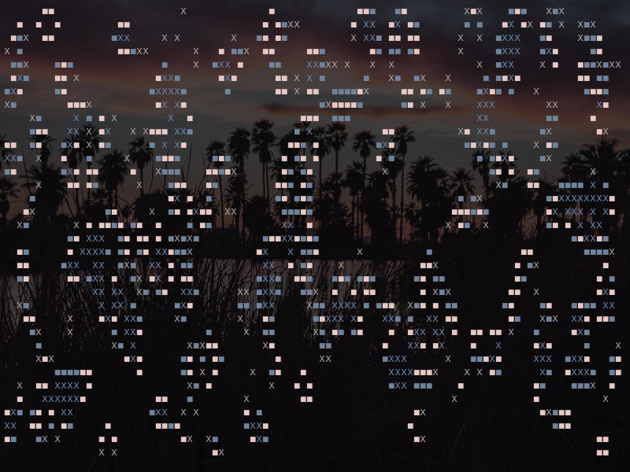

# Dead Cells, Game Of ~~The Year~~ Life-Finds-a-Way Edition

## Description

Although one could easily mistake this colorful *2D* game with a *metroidvania-like* platformer, it's actually a completely novel take on the genre where all of the gameplay was condensed in a rich linear story--deterministic even--where the protagonist is really a bunch of cells living (and dying) their best lives!

The simulation is an implementation of [Conway's Game of Life](https://en.wikipedia.org/wiki/Conway%27s_Game_of_Life) and it runs in a terminal emulator. That's it.

Next generation computation is multi-threaded thanks to the [rayon](https://crates.io/crates/rayon) library.

### Screenshots

Capture with the "**meta state**" flag enabled (it adds colors/symbol to cells that died or reproduced in the last iteration):

## Build

The program is built using `cargo` (comes with [rustup](https://www.rust-lang.org/tools/install)).

To build, run `cargo b --release`. The binary will be under `target/release`.

## Usage

Options are documented under the `--help` flag.

## Test

To run tests use `cargo t`.  
Currently there is only one test checking the correct implementation of the game rules.